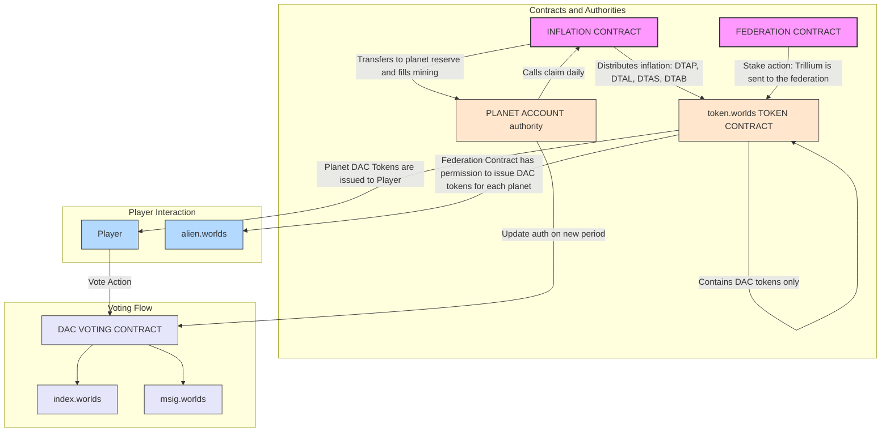
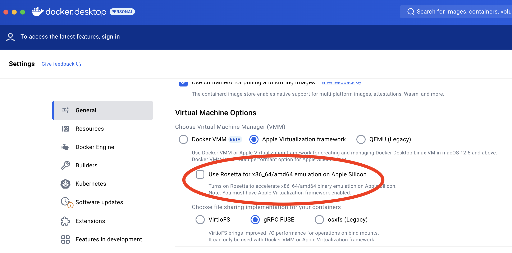

# Alien Worlds Smart Contracts


[](https://opensource.org/licenses/MIT)

## Overview

Alien Worlds is a blockchain-based metaverse that simulates economic cooperation and competition among players. This repository contains the core smart contracts that power the Alien Worlds ecosystem on the WAX blockchain.

These smart contracts form the backbone of various game mechanics including mining, staking, governance, and NFT management, enabling players to mine Trilium (TLM), participate in Planet DAOs, and engage in various in-game activities.

## Key Features

- **Mining System**: Handles resource mining mechanics and rewards distribution
- **NFT Management**: Powered by AtomicAssets for in-game items
- **Planetary Governance**: DAO structure for planet management
- **Token System**: TLM token management and distribution
- **Staking Mechanics**: Token staking and rewards
- **Game Features**: Competitions, gladiator battles, and more

## System Architecture

The Alien Worlds ecosystem is built on a sophisticated network of interconnected smart contracts. The system architecture is visualized in the following diagram:



The architecture illustrates the following key components and their interactions:

### Core Contracts

- **Mining Contract** (`m.federation`): Central gameplay mechanics
- **Federation Contract** (`federation`): Game-wide governance
- **Planets Contract**: Planetary management and governance
- **Inflation Contract** (`infl/`, account: `inflt.worlds`): Daily TLM inflation and planet claims

### Token & Asset System

- **TLM Token** (`alien.worlds`): Native cryptocurrency
- **AtomicAssets** (`atomicassets`): NFT standard implementation

### Game Features

- **Competitions**: Tournament and event management
- **Gladiator System**: Combat mechanics
- **Staking**: Token staking and rewards

### Land System

- **Landholders** (`contracts/landholders/`, account: `awlndratings`): Land ownership, commissions, attributes
- **Landboost** (`contracts/landboost/`, account: `boost.worlds`): Land enhancement mechanics and boost durations

### Points & Rewards

- **User Points** (`uspts.worlds`): Point tracking system
- **Points Proxy**: External point system integration

### Utility Services

- **Random Generator** (`orng.wax`): Verifiable randomness
- **Scheduled Payments**: Automated reward distribution

### NFT Management

- **NFT Mint Controller**: Minting rules and distribution
- **Pack Opener**: NFT pack mechanics

The system is designed with modularity in mind, allowing for:

- Independent component scaling
- Feature isolation
- Clear responsibility boundaries
- Efficient resource management
- Secure cross-contract communication

## Smart Contract Architecture

The Alien Worlds ecosystem is built on a sophisticated network of interconnected smart contracts, each serving specific functions in the game's economy and mechanics:

### Core Gaming Contracts

#### Mining Contract (`mining/`)

- **Purpose**: Manages the core mining gameplay mechanics
- **Key Features**:
  - Mining rewards calculation and distribution
  - Tool/NFT usage tracking and cooldowns
  - Land commission system
  - Anti-bot protection mechanisms
  - Mining difficulty adjustments
  - Rarity-based reward pools
- **Key Actions**: `mine`, `claimmines`, `setbag`, `setland`

#### Planets Contract (`planets/`)

- **Purpose**: Handles planetary governance and management
- **Key Features**:
  - Planet registration and management
  - Land mapping system (x,y coordinates)
  - Planetary stake tracking
  - NFT multiplier management
  - Planet metadata management
- **Key Actions**: `addplanet`, `updateplanet`, `setmap`

### Token and Asset Management

#### TLM Token Contract (`tlm.token/`)

- **Purpose**: Manages the Trilium (TLM) cryptocurrency
- **Features**:
  - Token transfers
  - Balance tracking
  - Token emission controls

#### AtomicAssets Integration (`atomicassets-contracts/`)

- **Purpose**: NFT management system
- **Features**:
  - NFT minting and burning
  - Asset transfers
  - Metadata management
  - Template management

### Game Mechanics

#### Federation Contract (`federation/`)

- **Purpose**: Manages game-wide governance and mechanics
- **Features**:
  - Global parameters
  - Cross-planetary interactions
  - Federation-level decision making

#### Inflation Contract (`infl/`, account: `inflt.worlds`)

- **Purpose**: Calculates and mints daily Trilium inflation, and manages planet claims
- **Features**:
  - `inflate`: Computes daily inflation capped by `DAILY_INFLATION_CAP_UNITS` and splits into DTAP (planets), DTAL (landowners), DTAS (satellites), DTAB
  - Tracks per-planet payouts in `payouts` and per-DAC payouts in `dacpayouts`
  - `claim`: Called by planet accounts to receive reserve and mining allocations; triggers `mining.fill` for the mining portion

#### Staking Contract (`staking/`)

- **Purpose**: Handles token staking mechanics
- **Features**:
  - Stake management
  - Reward distribution
  - Planetary governance weight
  - Unstaking timelock

#### Competitions Contract (`competitions/`)

- **Purpose**: Manages in-game competitions and events
- **Features**:
  - Competition creation and management
  - Reward distribution
  - Leaderboard tracking

#### Gladiator Contract (`alwgladiator/`, account: `f.federation`)

- **Purpose**: Combat and event mechanics
- **Features**:
  - Battle flows and rewards
  - Administration actions for events

#### Tokelore (`tokelore/`)

- **Purpose**: Power accrual and related configuration
- **Features**:
  - Power per day configuration
  - Progression tracking

### Land Management

#### Landholders Contract (`landholders/`)

- **Purpose**: Manages land ownership and properties
- **Features**:
  - Land ownership tracking
  - Commission management
  - Land attributes and metadata

#### Landboost Contract (`landboost/`)

- **Purpose**: Handles land enhancement mechanics
- **Features**:
  - Land attribute boosting
  - Temporary power-ups
  - Boost duration tracking

### Game Items and NFTs

#### NFT Mint Controller (`nftmintctl/`)

- **Purpose**: Controls NFT minting processes
- **Features**:
  - Minting rules and limits
  - Rarity distribution
  - Template management

#### Pack Opener (`packopener/`)

- **Purpose**: Handles NFT pack opening mechanics
- **Features**:
  - Pack contents generation
  - Rarity calculations
  - Reward distribution

#### Shining (`shining/`)

- **Purpose**: Item enhancement/shining flows
- **Features**:
  - Shining actions and validation
  - Reward and result management

### Utility Contracts

#### Orng WAX (`orngwax/`)

- **Purpose**: Provides verifiable randomness
- **Features**:
  - Random number generation
  - Seed management
  - Verification system

#### Schedule Pay (`schedulepay/`)

- **Purpose**: Manages scheduled payments and rewards
- **Features**:
  - Automated payments
  - Payment scheduling
  - Distribution tracking

#### Notify (`notify/`)

- **Purpose**: Cross-contract notification utilities
- **Features**:
  - Notification hooks
  - Integration points for events

#### Autoteleport (`autoteleport/`) and Mock Teleport (`mock.teleport/`)

- **Purpose**: Teleport trigger and testing helpers
- **Features**:
  - Scheduled/triggered teleport actions
  - Test scaffolding via mock contract

#### Testmarket (`testmarket/`)

- **Purpose**: Lightweight market utilities for tests
- **Features**:
  - Simplified market operations for testing scenarios

### Points and Rewards

#### User Points (`userpoints/`)

- **Purpose**: Manages user point system
- **Features**:
  - Point tracking
  - Reward calculations
  - Achievement system

#### Points Proxy (`pointsproxy/`)

- **Purpose**: Interfaces with external point systems
- **Features**:
  - Cross-platform point integration
  - Point conversion
  - External system communication

### Infrastructure

#### Common (`common/`)

- **Purpose**: Shared utilities and helpers
- **Features**:
  - Common data structures
  - Shared functions
  - Helper utilities

#### EOSDAC Governance Contracts (`eosdac-contracts/`)

- **Purpose**: Vendor governance modules used by Planet DAOs
- **Notes**:
  - Tests are excluded by default in this repository (see `.lamingtonrc`)

Each contract is designed to be modular and interoperable, allowing for flexible game mechanics and future expansions.

## Technical Stack

- **Blockchain**: EOSIO/Antelope/Leap
- **Development Framework**: Lamington
- **Testing**: Chai/Mocha
- **Smart Contract Language**: C++
- **Build System**: EOSIO.CDT

## Getting Started

### Prerequisites

- Node.js 18 (use `nvm use` to select the version from `.nvmrc`)
- Docker (for local development)

### Installation

1. Clone the repository:

```bash
git clone --recursive https://github.com/Alien-Worlds/alienworlds-contracts.git
cd alienworlds-contracts
```

2. Install dependencies:

```bash
npm install
```

##### Git Hooks & Formatting

```bash
# Husky hooks install automatically via npm prepare
npm install

# Verify formatting on staged files
npx lint-staged --debug
```

### Building the Contracts

```bash
npm run build
```

### Running Tests

```bash
npm test
```

## Development Guide

### Build Process

The build process uses Lamington, which provides a streamlined way to compile and test EOSIO smart contracts. The configuration can be found in `.lamingtonrc`.

Note: when adding a new contract, append its `.cpp` filename to the `.lamingtonrc` `include` list so it is compiled.

### Environment Setup

#### System Requirements

- Ubuntu 18.04 or higher (recommended) / macOS
- At least 8GB RAM
- 50GB available disk space
- Docker installed and running
- Node.js 18

#### Docker Setup

##### Installation Instructions

###### Ubuntu

```bash
# Remove old versions
sudo apt-get remove docker docker-engine docker.io containerd runc

# Update package index
sudo apt-get update

# Install dependencies
sudo apt-get install \
    ca-certificates \
    curl \
    gnupg \
    lsb-release

# Add Docker's official GPG key
sudo mkdir -p /etc/apt/keyrings
curl -fsSL https://download.docker.com/linux/ubuntu/gpg | sudo gpg --dearmor -o /etc/apt/keyrings/docker.gpg

# Set up repository
echo \
  "deb [arch=$(dpkg --print-architecture) signed-by=/etc/apt/keyrings/docker.gpg] https://download.docker.com/linux/ubuntu \
  $(lsb_release -cs) stable" | sudo tee /etc/apt/sources.list.d/docker.list > /dev/null

# Install Docker Engine
sudo apt-get update
sudo apt-get install docker-ce docker-ce-cli containerd.io docker-compose-plugin

# Start Docker
sudo systemctl start docker

# Enable Docker to start on boot
sudo systemctl enable docker

# Add your user to docker group (to run docker without sudo)
sudo usermod -aG docker $USER
```

###### macOS

1. Download Docker Desktop for Mac from [Docker Hub](https://docs.docker.com/desktop/setup/install/mac-install/)
2. Double-click `Docker.dmg` to open the installer
3. Drag Docker to Applications
4. Start Docker from Applications folder

**Important Note for Apple Silicon Users:**

- If you are getting `Runtime Error Processing WASM` errors during testing, turn off "Use Rosetta for x86_64/amd64 emulation on Apple Silicon" in Docker Desktop settings.



##### Post-Installation Setup

###### Verify Installation

```bash
# Check Docker version
docker --version

# Verify Docker is running
docker run hello-world
```

###### Configure Resources

- **Docker Desktop (macOS)**

  - Open preferences/settings
  - Go to Resources
  - Allocate at least 4GB RAM
  - Allocate at least 50GB disk space

- **Linux Configuration**
  - Edit `/etc/docker/daemon.json`:
    ```json
    {
      "memory": "4g"
    }
    ```

Reference compose file: a sample `docker-compose.yml` for operational tooling is available at `scripts/docker-compose.yml`. Lamington manages its own local node for tests.

###### Troubleshooting

- **Docker Service Issues**

  ```bash
  # Check Docker status
  sudo systemctl status docker

  # View Docker logs
  sudo journalctl -fu docker
  ```

#### Development Dependencies

##### Node.js Setup

```bash
# Use the correct Node.js version
nvm use
# Install dependencies
npm install
```

### Building the Contracts

1. **Clean Build**

   ```bash
   # Fresh build intended for production
   npm run build -- -f
   # Or simply
   yarn build -f
   ```

2. **Development Build**

   ```bash
   # Build with test configuration intended for local development
   npm run dev_build
   ```

3. **Individual Contract Build**

   ```bash
   # Build specific contracts using Lamington
   npm run build -- -p <contract name> -f
   # Or simply
   yarn build -p <contract name> -f
   ```

4. **Staging/Test-Deploy Build**

   ```bash
   # Build with staging flags intended for test deployments
   npm run test_build
   ```

5. **Stop Local Node**

   ```bash
   npm run stop
   ```

### Build Artifacts

Artifacts are written under `artifacts/compiled_contracts/`:

- Production builds: `artifacts/compiled_contracts/contracts/<contract>/<contract>.{wasm,abi}`
- Development builds (`-DIS_DEV`): `artifacts/compiled_contracts/IS_DEV/contracts/<contract>/<contract>.{wasm,abi}`

Each contract produces:

- `.abi` files: Contract ABI definitions
- `.wasm` files: WebAssembly bytecode

### Testing the Build

1. **Run All Tests**
   ```bash
   npm test
   ```
2. **Run Specific Contract Tests**
   ```bash
   npm test -- -G <regex of mocha describe block>
   # Or simply
   yarn test -G <regex of mocha describe block>
   ```
   So for example to run all tests in the `mining` contract you would use:
   ```bash
   npm run test -- -g Mining
   # Or simply
   yarn test -G Mining
   ```

To force recompilation of the contracts before testing, use the `-f` flag:

```bash
npm run test -- -G Mining -f
# Or simply
yarn test -G Mining -f
```

To force recompilation of only the mining contract before testing, use the `-f` flag:

```bash
npm run test -- -G Mining -p mining -f
# Or simply
yarn test -G Mining -p mining -f
```

### Development Workflow

1. Make changes to contract source files
2. Run tests to verify changes
3. Build live version of contracts
4. Deploy contracts

### Testing Environment

Tests are written using Chai and can be found alongside the contract implementations. Use the test command to run the full test suite:

```bash
npm run test
# Or simply
yarn test
```

### Testing Guidelines

- Tests run via Lamington with Mocha/Chai. The local chain state is shared across `describe`/`context`/`it` blocks (no rollback between tests).
- Simulating time:
  1. Use `await sleep(5)` to advance wall time.
  2. In `-DIS_DEV` builds, time-dependent actions expose an extra `time_point_sec` parameter so tests can pass a simulated timestamp. In production builds the same actions compute `current_time_point()` internally.

Example (C++):

```cpp
#ifdef IS_DEV
ACTION mycontract::someaction(name user, time_point_sec current_time) {
#else
ACTION mycontract::someaction(name user) {
    const auto current_time = time_point_sec(current_time_point());
#endif
    // ...
}
```

Example (TypeScript test; build with `npm run dev_build`):

```ts
const simulated = new Date('2025-01-01T00:00:00Z');
await contracts.mycontract.contract.someaction(user.name, simulated, {
  from: user,
});
```

- Test exclusions: `contracts/eosdac-contracts/**` tests are excluded by default via `.lamingtonrc`.

## Contributing

We welcome contributions from the community! Here's how you can help:

1. Fork the repository
2. Create a feature branch (\`git checkout -b feature/amazing-feature\`)
3. Commit your changes (\`git commit -m 'Add amazing feature'\`)
4. Push to the branch (\`git push origin feature/amazing-feature\`)
5. Open a Pull Request

## Security

### Reporting Security Issues

Please report security vulnerabilities to [security@alienworlds.io](mailto:security@alienworlds.io). We will respond as quickly as possible to address any concerns.

## License

This project is licensed under the MIT License - see the LICENSE file for details.

## Support

- Join our [Discord](https://discord.gg/alienworlds) for community discussions
- Visit the [Alien Worlds Website](https://alienworlds.io/) for the latest news
- Follow us on [X](https://x.com/AlienWorlds) for updates

## Acknowledgments

- The Alien Worlds Community
- Contributors and Developers
- AtomicAssets Team
- WAX Blockchain Community

---

Built with ❤️ by the Alien Worlds Team
